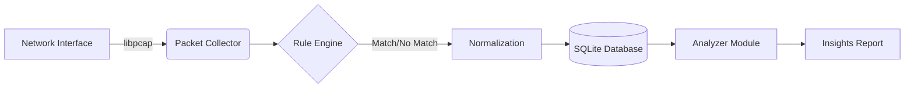

# Isolated Network Log Analyser

## 1. Background & Idea
Continuous monitoring of systems and networks is essential to detect, prevent, and respond to cyber security threats. Security Operation Centres (SOC) rely on this monitoring for situational awareness, providing a near real-time perception of the threat landscape.

However, in high-security environments, **isolated networks** (air-gapped or restricted) cannot send logs to a central cloud SOC in real-time due to security policies or connectivity constraints.

**The Solution:** This project is a lightweight, portable **Log & Network Analyser** written in C. It is designed to be deployed independently within isolated networks to:
1.  **Capture** network traffic and logs locally.
2.  **Analyze** traffic against a set of detection rules (Signatures/Regex).
3.  **Store** normalized data in a local, lightweight database (SQLite).
4.  **Generate** insights and reports on-site without needing internet connectivity.

## 2. System Design
The system follows a modular pipeline architecture designed for performance and portability.



## 3. Implementation Details
The project is implemented in **C (Standard C11)** to ensure low memory footprint and high performance on constrained hardware.

### Technical Stack
* **Build System:** CMake
* **Packet Capture:** `libpcap` (Standard library for network traffic capture).
* **Database:** `sqlite3` (Embedded relational database).
* **Pattern Matching:** POSIX `regex.h`.

### Key Files
* `src/collectors/pcap_collector.c`: Handles live packet interception. It parses Ethernet, IP, and Transport layer (TCP/UDP) headers to extract source/dest IPs and ports.
* `src/analyzers/rules.c`: Contains the threat signatures. It compiles regex patterns at runtime and classifies logs as INFO, LOW, MEDIUM, or HIGH.
* `src/core/database.c`: Manages the SQLite connection and executes `INSERT` transactions for every captured packet.
* `src/analyzers/analyzer.c`: Runs SQL aggregation queries to produce the final intelligence reports.

## 4. Prerequisites
Before building, ensure your system has the necessary C libraries installed.

**On Ubuntu/Debian:**
```bash
sudo apt update
sudo apt install build-essential cmake libpcap-dev libsqlite3-dev
```

## 5. Build Instructions
```bash
# 1. Create a build directory
mkdir build
cd build

# 2. Generate build files using CMake
cmake ..

# 3. Compile the project
make
```

## 6. Usage Guide
The tool operates via command-line arguments. **Note:** You must use `sudo` for network capture operations.

### 1. List Network Devices
Find the name of the interface you want to monitor (e.g., `eth0`, `wlp1s0`).
```bash
sudo ./loganalyser --devices
```

## 7. Configuration & Extensibility
* **Adding Rules:** New threat detection patterns can be added in `src/analyzers/rules.c` inside the `DetectionRule rules[]` array.
* **Database:** The data is stored in `logs.db`, which can also be opened with any standard SQLite viewer for manual inspection.
